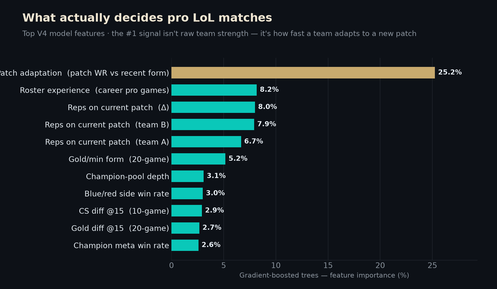
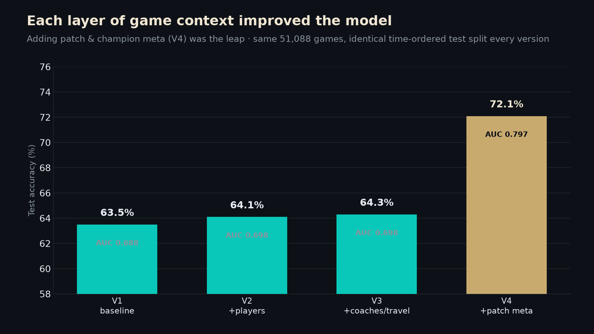

# LoL Esports Match Prediction Model

A machine-learning model that predicts the winner of professional *League of Legends*
esports matches, **built entirely from scratch in NumPy** — no scikit-learn, no XGBoost,
no deep-learning frameworks. Every algorithm (logistic regression, gradient-boosted trees,
random forest, a small MLP, and a stacking ensemble) is implemented by hand in
[`src/ml_from_scratch.py`](src/ml_from_scratch.py).

Trained on **51,088 games** from [Oracle's Elixir](https://oracleselixir.com) (2021–2026),
the final model reaches **AUC 0.797 / 72.1% accuracy** on a held-out, time-ordered test set.

More than a modelling exercise, this is an attempt to answer a **game-design question with data**:
*when two pro teams sit down, what actually decides the result?* The answer the model keeps
returning is not raw team strength — it's **how quickly a team adapts to the current patch.**



> Constraint that shaped the project: the build environment had no internet package access
> (a proxy blocked `pip`), so every model had to be written from first principles in NumPy.
> That turned into the most interesting part of the work.

---

## Hypothesis

> Professional match outcomes can be predicted meaningfully better than a naive
> team-strength baseline (Elo + recent win rate) by engineering features from historical
> match data — and in particular, **contextual "meta" signal (patch maturity and champion
> meta) carries predictive information beyond raw team strength.**

Two sub-questions drove the four versions:

1. Does adding **player-, coach-, and travel-level** context beat a team-only baseline?
2. Does **patch/champion meta** context (how settled the current patch is, how comfortable
   each team is on the current meta) add signal on top of that?

---

## What was tested

The project evolved through four feature generations, each re-evaluated on the **same**
time-ordered test split so improvements are directly comparable.

| Version | Feature theme added | # features |
|--------:|---------------------|:----------:|
| **V1** | Baseline: Elo, rolling win rates, side, head-to-head, league tier, playoffs, Bo-format | 63 |
| **V2** | Per-player tracking: KDA, champion pools, hot streaks, series momentum, fearless-draft & sub detection | 79 |
| **V3** | Coaches (Leaguepedia), travel / home advantage, regional playstyle profiles | 106 |
| **V4** | **Patch meta** (patch maturity, patch-vs-recent WR delta) + **champion meta** (pick rate, champ WR, comfort, meta conformity, ban pressure) | 130 |

Five model families were implemented and compared: **Logistic Regression**,
**Gradient-Boosted Trees**, **Random Forest**, a 2-hidden-layer **Neural Network**, and a
**Stacking Ensemble** meta-learner.

### Methodology (guarding against leakage)

- **Temporal split**, ordered by date: 75% train / 10% validation / 15% test. No future
  data ever informs a past prediction.
- Every feature for a given game is computed using **only data available before that game**
  (dynamic Elo with season decay, rolling 5/10/20-game windows, running meta counts).
- Calibration is evaluated explicitly (Brier score + reliability curves), not just accuracy.

---

## Results

Final V4 model comparison on the held-out test set (`results/model_comparison.csv`):

| Model | AUC | Brier | Log Loss | Accuracy |
|-------|:---:|:-----:|:--------:|:--------:|
| Logistic Regression | 0.785 | 0.189 | 0.562 | 71.8% |
| **Gradient-Boosted Trees** | **0.797** | **0.188** | 0.558 | **72.1%** |
| Blend (LR + GBDT) | 0.795 | 0.185 | 0.548 | 72.3% |

Progression across versions (best model each generation, identical test split):



| Version | Best model | AUC | Brier | Accuracy | Features |
|---------|------------|:---:|:-----:|:--------:|:--------:|
| V1 | LR | 0.688 | 0.223 | 63.5% | 63 |
| V2 | Ensemble | 0.698 | 0.220 | 64.1% | 79 |
| V3 | GBDT | 0.698 | 0.220 | 64.3% | 106 |
| **V4** | **GBDT** | **0.797** | **0.188** | **72.1%** | 130 |

**Most important features (V4 GBDT, `results/feature_importance.csv`):**

| Feature | Importance | Meaning |
|---------|:----------:|---------|
| `patch_wr_delta_diff` | 25.3% | How much better/worse each team is doing on the *current* patch vs. its recent form |
| `player_experience_diff` | 8.2% | Difference in accumulated pro games between rosters |
| `team_patch_games_diff` | 8.0% | Reps each team has on the live patch |
| `avg20_earned_gpm_diff` | 5.2% | 20-game rolling gold-per-minute differential |

---

## Conclusion

- **Both hypotheses held.** Every layer of context improved the model, and the **patch/champion
  meta features (V4) produced the single biggest jump** — AUC 0.698 → 0.797 and accuracy
  64% → 72% — despite adding only 24 features on top of V3.
- The standout signal is **`patch_wr_delta_diff`** (25% of GBDT importance): teams that are
  over- or under-performing their baseline *on the current patch* are the strongest predictor
  of the next result. This is intuitive — early-patch adaptation separates top teams — and it
  is signal a pure Elo model cannot see.
- **Calibration improved alongside discrimination** (Brier 0.223 → 0.188), so the model isn't
  just ranking better, its probabilities are more trustworthy.
- **Honest limitations:** on a tiny out-of-distribution tournament sample (First Stand 2026,
  ~10 matched games) the edge disappears into noise — best-of series between evenly matched
  elite teams are inherently low-signal, and no 51k-game model fixes a 10-game sample. See
  `worklog.md` for the full write-up.

---

## What this says about League — a designer's lens

I built this as a designer who wanted to *interrogate the game's systems with data*, not just
chase an accuracy number. A few takeaways I find genuinely interesting for how competitive
League is designed:

- **The meta is a skill, not a backdrop.** The single most predictive signal — by a wide margin
  — is how well a team is performing *on the current patch relative to its own recent form*
  (25% of model importance, more than 3× the next feature). Patch churn isn't noise the best
  teams ride out; **adapting to it faster is the competitive edge.** That reframes patch cadence
  as a core design lever on competitive integrity, not just a balance-maintenance chore.
- **Flexibility beats mastery, a little.** Champion-pool depth and meta-conformity features
  carry real weight, while single-champion "comfort" carries less. The systems reward teams
  that can move *with* the meta over one-tricks — a design outcome most balance teams want.
- **The early game still writes the story.** Gold- and CS-differential-at-15 features remain
  predictive across every version, a quiet vote of confidence in lane-phase design: the first
  15 minutes still meaningfully shape outcomes even at the pro level.
- **Parity at the very top is real — and probably healthy.** When I stress-tested the model on
  a single elite tournament's finals, its edge collapsed toward a coin flip. Between the best
  teams on a settled patch, the game is close to a toss-up — which is arguably exactly what you
  want the ceiling of a competitive game to feel like.

*(Every claim above traces to a specific engineered feature and its measured importance — see
`results/feature_importance.csv` and the per-version notes in `worklog.md`.)*

---

## Repository structure

```
lol-esports-predictor/
├── README.md                     # you are here
├── worklog.md                    # detailed development log (architecture, bugs, decisions)
├── .env.example                  # env-var template (Riot API key placeholder)
├── src/                          # all model + feature-engineering code (pure NumPy)
│   ├── ml_from_scratch.py        #   ML library: LR, GBDT, RF, NN, stacking, metrics
│   ├── feature_engineering.py    #   V1 features (baseline)
│   ├── feature_engineering_v2.py #   V2 features
│   ├── v3_enhancements.py        #   V3 features (coaches, travel, playstyle)
│   ├── v4_enhancements.py        #   V4 features (patch meta, champion meta)
│   ├── train_and_evaluate.py     #   V1 training pipeline
│   ├── train_and_evaluate_v2.py  #   V2 training pipeline
│   ├── train_and_evaluate_v3.py  #   V3 training pipeline
│   └── simulate_fst2026.py       #   First Stand 2026 tournament back-test
├── app/                          # React prediction UIs (Elo+WR proxy + player H2H)
│   ├── lol_predictor_v4.jsx      #   latest
│   └── lol_predictor_v2.jsx
├── models/                       # trained weights (NumPy .npz)
│   ├── logistic_regression.npz
│   └── model_params.npz          #   feature means/stds + names
├── results/
│   ├── model_comparison.csv      # V4 model metrics
│   ├── feature_importance.csv    # top V4 GBDT features
│   └── charts/{v2,v3}/           # ROC, calibration, feature-importance plots
└── data/                         # (gitignored) raw Oracle's Elixir CSVs — see data/README.md
```

---

## Running it

Requires Python 3.9+ with `numpy`, `pandas`, `matplotlib`, `seaborn`.

1. **Get the data** — follow [`data/README.md`](data/README.md) to download the Oracle's
   Elixir CSVs into `data/`.
2. **Engineer features & train** (run from `src/`, scripts expect `data/` alongside):
   ```bash
   cd src
   python v4_enhancements.py        # build the 130-feature dataset
   python train_and_evaluate_v3.py  # or v2 — trains, evaluates, writes charts + weights
   ```
   The build environment was memory-constrained (~3.9 GB RAM), so the scripts read CSVs in
   chunks and free memory aggressively — see `worklog.md` for the memory notes.
3. **Prediction UI** — the `app/*.jsx` files are self-contained React components that use a
   calibrated Elo+WR proxy formula (a faithful simplification of the full model) plus
   per-position player head-to-head stats. Drop one into any React scaffold to run it.

### Riot API key

No script currently calls the Riot API. A development key was reserved for planned
solo-queue data enrichment; if you wire it up, copy `.env.example` to `.env` and set
`RIOT_API_KEY`. `.env` is gitignored.

---

## Notes & credits

- Match data © [Oracle's Elixir](https://oracleselixir.com) (Tim Sevenhuysen). Please credit
  the source and follow their terms.
- Coach data scraped from the Leaguepedia Cargo API.
- All ML implemented from scratch in NumPy as a deliberate exercise — see
  [`worklog.md`](worklog.md) for the full engineering narrative, including the bugs and
  memory-optimization work behind each version.
